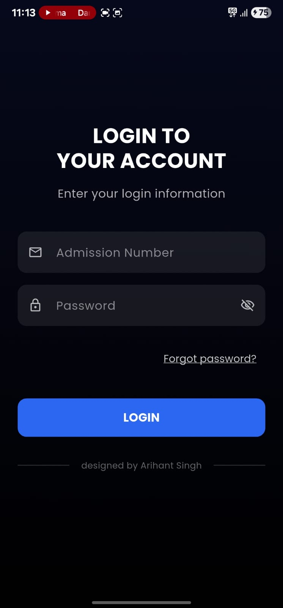
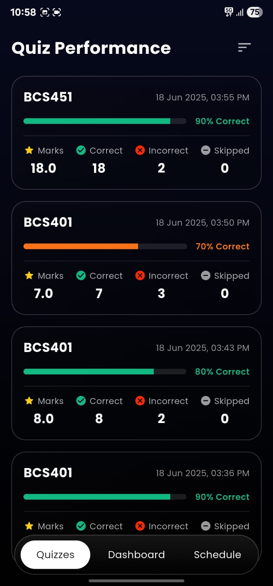
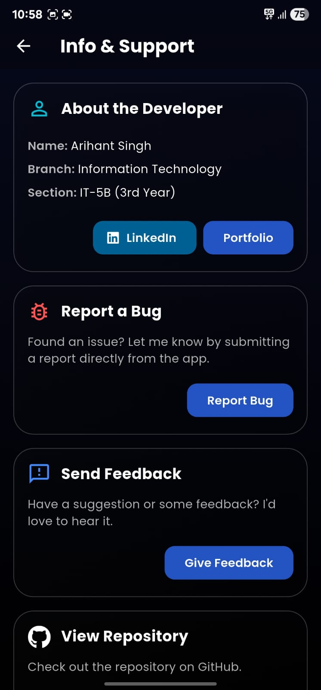
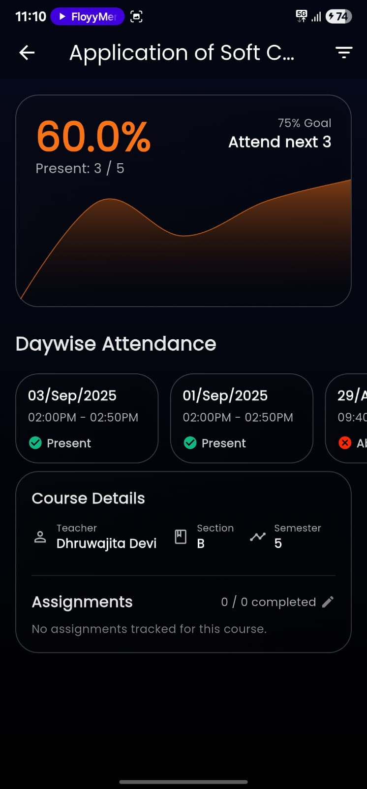
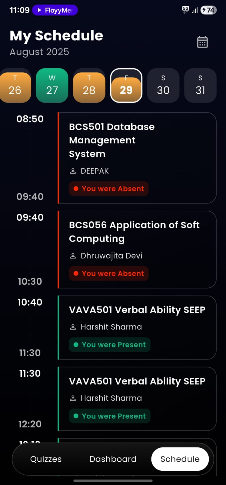
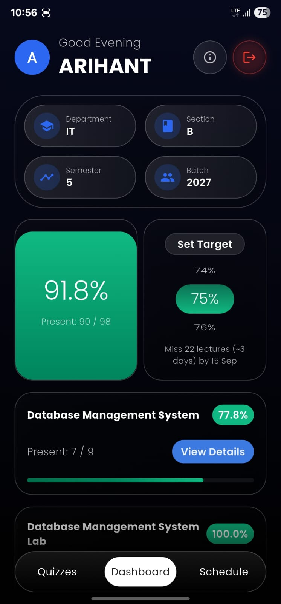

#  ABESPLUS🚀

## Download 📲

Ready to simplify your college life? Download the latest version of the Abesplus app now!

  

*Note: You may need to enable installation from "Unknown Sources" in your Android settings.*

  <strong>Your Ultimate Companion for Life at ABES Engineering College!</strong>

  <a href="#features">Features</a> •
  <a href="#screenshots">Screenshots</a> •
  <a href="#download">Download</a> •
  <a href="#tech-stack">Tech Stack</a> •
  <a href="#contact">Contact</a>

## Screenshots 📸

    
    
    
    

    
    
    

## Overview 📝

**Abesplus** is a comprehensive mobile application designed exclusively for the students of ABES Engineering College. Say goodbye to the hassle of managing your academic life manually! With Abesplus, you can effortlessly track your attendance, stay updated with your class schedule, participate in quizzes, and much more, all from the palm of your hand. Our goal is to provide a seamless and intuitive experience, making your college journey smoother and more organized.

## Features ✨

- **📊 Attendance Tracking**: Keep a real-time track of your attendance percentage for every subject. No more surprises at the end of the semester!
- **🗓️ Attendance Planner**: Smartly plan your leaves and bunks while ensuring you stay above the required attendance criteria.
- **📅 Daily Attendance View**: Get a detailed, day-by-day breakdown of your attendance records.
- **⏰ Schedule Viewer**: Access your updated class schedule anytime, anywhere. Never miss a lecture or a lab session again.
- **🧠 Quiz Platform**: Participate in quizzes, test your knowledge, and compete with your peers.
- **💬 Community Hub**: A dedicated space to connect with fellow students, share updates, and stay informed about college events and happenings.
- **📶 Auto WiFi Login**: Automatically and securely log in to the college's Wi-Fi network without the repetitive hassle of entering credentials.
- **ℹ️ Student Information**: All your personal and academic details, neatly organized and accessible in one place.
- **📱 Home Widget Support**: Get a quick glance at your attendance status right from your phone's home screen.

## Tech Stack 💻

This application is built with a modern and robust tech stack to ensure a high-quality user experience.

- **Core Framework**:
  - 
  - 
- **Backend & Database**:
  - 
  - 
- **UI & Design**:
  - 
  - 
  - 
- **Networking & Data**:
  - 
  - 
- **Utilities**:
  - 

## Contact & Feedback 📬

Have questions, suggestions, or feedback? We'd love to hear from you!

- **Your Name**: Arihant Singh
- **Email**: [arihants2004@gmail.com](mailto:arihants2004@gmail.com)

---

  Developed by, ARIHANT SINGH

